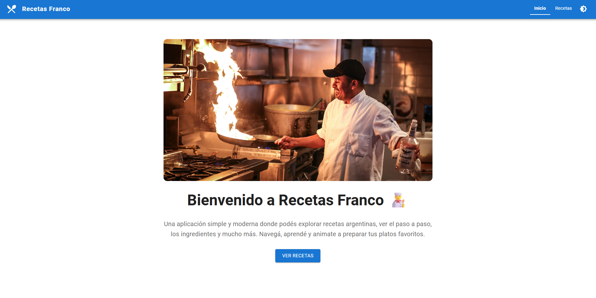

# Trabajo Práctico – Aplicación de Recetas de Cocina

Aplicación React que muestra un catálogo de recetas y permite navegar hacia el detalle de cada una utilizando React Router DOM, Context API y Material-UI.

## 🚀 Características
- Listado de recetas con tarjetas responsive, chips informativos y acciones claras.
- Vista de detalle con imagen destacada, ingredientes estructurados y pasos enumerados.
- Context API para compartir el estado (recetas, loading y manejo de errores) en toda la app.
- Datos locales en `src/data/recetas.json` (6 recetas completas).
- Navegación con rutas `/`, `/recetas` y `/recetas/:id`.
- Diseño responsive con componentes de Material-UI (Container, Grid, Card, Stack, List, etc.).

## 🧱 Estructura Principal
```
src/
├── App.jsx
├── main.jsx
├── components/
│   ├── layout/Navbar.jsx
│   └── recetas/
│       ├── RecetaCard.jsx
│       ├── RecetasList.jsx
│       ├── RecetaDetalle.jsx
│       └── IngredientesList.jsx
├── contexts/RecetasContext.jsx
├── data/recetas.json
├── pages/
│   ├── RecetasListPage.jsx
│   └── RecetaDetallePage.jsx
└── styles.css
```

## 🛠️ Tecnologías
- React 19
- React Router DOM 7
- Context API
- Material-UI 7 + Emotion

## ▶️ Scripts Disponibles
Instalar dependencias:
```
npm install
```

Iniciar el entorno de desarrollo:
```
npm start
```

Construir para producción:
```
npm run build
```

## ✅ Estado
Proyecto completo y listo para evaluación del Trabajo Práctico de Programación IV.

---

## Screenshots

### Página de Inicio


### Listado de Recetas


### Detalle de Receta

Desarrollado por Franco Sciascia 👨‍🍳
